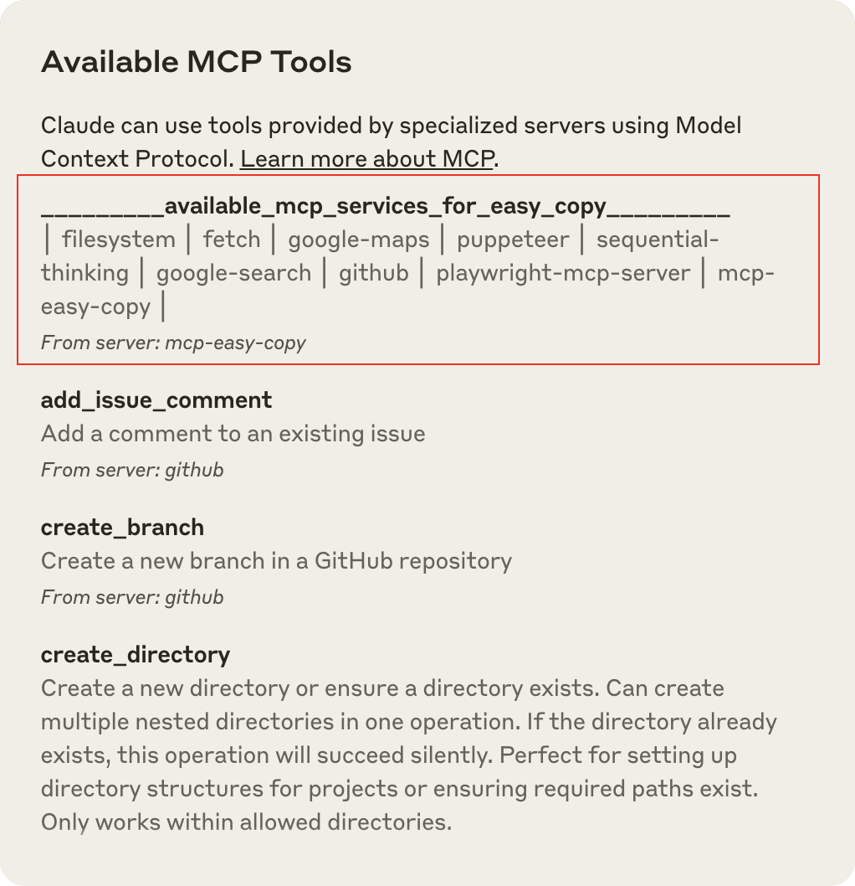

# MCP Easy Copy

A Model Context Protocol server that makes it easy to discover and copy available MCP services in Claude Desktop.



## Purpose

This MCP server is designed to be your first stop when working with Claude Desktop. It solves the problem of having to remember MCP service names or looking them up in configuration files by:

1. Automatically reading the Claude Desktop configuration file
2. Extracting the names of all configured MCP services
3. Presenting them in an easy-to-copy format at the top of the tools list

Although Claude can now automatically select the appropriate MCP services in most scenarios, there are still situations where users need to explicitly specify an MCP service name. This tool bridges that gap, making all available services easily accessible without having to search through configuration files.

## Features

- **Appears at the top of tools list**: Uses special name formatting to always appear first
- **Dynamic updates**: Always shows the latest available services
- **Copy-friendly format**: Numbered list for easy reference
- **Zero external dependencies**: Just needs Node.js

## Installation

### Option 1: Install via npm (Recommended)

```bash
npm install -g @fishes/mcp-easy-copy
```

Then add to your Claude Desktop configuration:

```json
{
  "mcpServers": {
    "mcp-easy-copy": {
      "command": "npx",
      "args": [
        "-y",
        "@fishes/mcp-easy-copy"
      ]
    }
  }
}
```

### Option 2: Manual Installation

1. Clone the repository:
   ```bash
   git clone https://github.com/fisheepx/mcp-easy-copy.git
   cd mcp-easy-copy
   ```

2. Install dependencies and build:
   ```bash
   npm install
   npm run build
   ```

3. Configure Claude Desktop:
   
   **For macOS:**
   Edit `~/Library/Application Support/Claude/claude_desktop_config.json`
   
   **For Windows:**
   Edit `%APPDATA%\Claude\claude_desktop_config.json`
   
   Add the following configuration:
   ```json
{
   "mcpServers": {
   "mcp-easy-copy": {
   "command": "node",
   "args": [
   "/ABSOLUTE/PATH/TO/mcp_easy_copy/build/index.js"
   ]
   }
   }
}
```

4. Restart Claude Desktop


## Using the Tool

Once installed, you can use the service in two ways:

1. **Via the tools menu:** Click the hammer icon in Claude Desktop and select the service at the top of the list (it will show all available services in its description)

2. **Via a prompt:** Ask Claude something like:
   ```
   Please list all MCP services that are available to you
   ```
   or
   ```
   Please use _________mcp-easy-copy_________ to show me all available MCP services
   ```

## Development

MCP Easy Copy is built with TypeScript and uses the Model Context Protocol SDK.

```bash
# Install dependencies
npm install

# Build the project
npm run build

# Test with the MCP Inspector
npm run inspector
```

## Troubleshooting

If the tool doesn't work as expected:

1. **Check logs**: Look at the log files
   - macOS: `~/Library/Logs/Claude/mcp-server-mcp-easy-copy.log`
   - Windows: `%APPDATA%\Claude\logs\mcp-server-mcp-easy-copy.log`

2. **Verify configuration**: Make sure your `claude_desktop_config.json` is valid JSON

3. **Check Node.js**: Ensure Node.js is properly installed (`node --version`)

4. **Restart Claude**: Always restart Claude Desktop after making configuration changes

5. **Use the Inspector**: Run `npm run inspector` to debug with the MCP Inspector

## License

[MIT License](LICENSE)

## Future Vision

While we have no specific knowledge of Anthropic's roadmap, we imagine that future versions of Claude's client could potentially implement features like autocomplete when using the '@' symbol. Such a feature might display a dropdown list of available MCP services, making it much easier for users to explicitly instruct Claude to utilize specific services.

Even if such improvements eventually make this project obsolete, we'd be delighted to see Claude's interface evolve in ways that improve user experience. After all, the goal of this tool is to make MCP services more accessible, and having that functionality built directly into Claude would be the ultimate success.